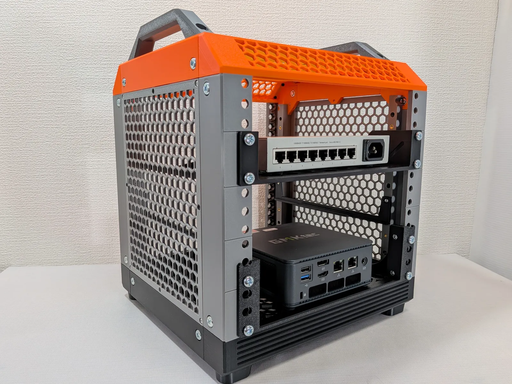
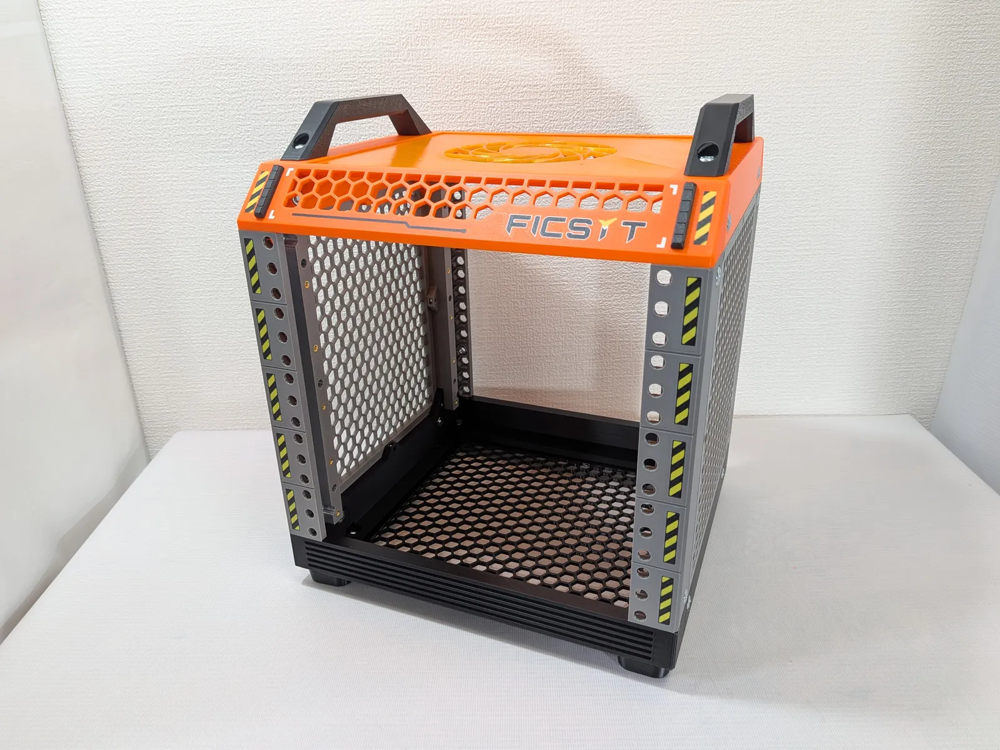

# FIR RACK - 3Dプリント可能な10インチ サーバーラック

[English](./README.md) | **日本語**

## 概要

FIR RACKはmklements氏の[Lab Rax](https://makerworld.com/en/models/1294480-lab-rax-10-server-rack-5u#profileId-1325352)のリミックスです。FIR RACKはLab Raxの組み立てやすさや意匠を真似て作られていますが、設計はゼロから行いました。そのためLab Raxと互換性はありません。

## FIR RACKの特徴

FIR RACKはLab Raxの素晴らしさを引き継ぎつつ、以下の改良をしています。

* 解体せずにサイドパネルが外せる
* マウントレールのナットの取り付け・取り外しが簡単
* 足の安定性向上
* 奥行きの拡張 240mm → 260mm
* 重いシェルフ用のサポートレール (optional)

## FIR RACKの拡張性
* **ユニット数の変更** 
    FIR RACKは5Uサイズです。拡張キットを使用すると3Uまたは5Uを追加することができます。たとえば5Uに3Uを追加すると、8Uのラックが作れます。
* **サポートレールの追加** 
    重いシェルフを搭載する場合は、オプションのサポートレールを使用することで、マウントレールに負荷がかからないようにすることができます。

## 4つのプリントプロファイル

FIR RACKには4つのプロファイルがあります。最低限のラックならBASICプロファイルだけで作れます。

| プロファイル | 用途 | 備考 |
|---|---:|---|
| BASIC | 基本のパーツ | 必須 |
| PANEL | 上下および左右のパネル | optional |
| EXTEND | 延長用パーツ | optional |
| RAIL | サポートレールの追加 | optional |

## 必要なパーツ
FIR RACKを組み立てる場合に必要なパーツは以下の通りです。

| パーツ | 数量 | 備考 |
|---|---:|---|
| M6ナット | 24 | 必須 |
| M6ねじ（なべねじ） 12mm | 24 | 必須 |
| M3ナット | 16 | サイドパネル取付用 (optional) |
| M3ねじ（なべねじ） 12mm | 16 | サイドパネル取付用 (optional) |
| M6ナット | 8 | 延長パーツ取付用 (optional) |
| M6ねじ（なべねじ） 12mm | 8 | 延長パーツ取付用 (optional) |
| M3ナット | 12 | 延長パーツ取付用 (optional) |
| インサートナット M3 (OD:5mm Len:4mm) | 32 | サポートレール取付用 (optional) |
| M3ねじ 5mm | 12 | サポートレール取付用 (optional) |

このほかに、取り付けるシェルフの数に応じたM6ナット、M6ねじ 12mmが必要です。

### 安い購入先の例
* M6ナット: [Amazon](https://www.amazon.co.jp/dp/B002A5NN3O)
* M6ねじ（なべねじ） 12mm: [Amazon](https://www.amazon.co.jp/dp/B002A5MHGS)
* インサートナット M3 (OD:5mm Len:4mm): [Amazon](https://www.amazon.co.jp/dp/B0F5HMVBWJ) [AliExpress](https://ja.aliexpress.com/item/1005008301059667.html)

## 3Dモデルのダウンロード

FIR RACKはMakerWorldでダウンロード可能です。 
https://makerworld.com/en/models/3273170-fir-rack-3d-printable-10-inch-server-rack

シェルフは本リポジトリからダウンロード可能です。 
[shelf/](shelf/)

FIR RACKのリミックスを作成する場合は、このモデルのプロファイルに追加しないでください。リミックスはあなたのMakerWorldアカウント上で公開してください。

## 組み立て手順

フィラメントは PETG でプリントすることをおすすめします。PLA は高温により変形する恐れがあります。組み立て手順は以下のドキュメントをご覧ください。

組み立て手順: [English](doc/assembly-en.md) | [日本語](doc/assembly-ja.md)

## 配布しているファイル

このリポジトリでは以下のファイルを配布しています。

* [シェルフの3Dモデル](shelf/)

## FIR RACK Satisfactory Kit

[Satisfactory](https://store.steampowered.com/app/526870/Satisfactory/)の世界観が楽しめるFIR RACKの交換パーツキットです。AMSによるマルチカラープリントに対応しています。[→ダウンロード](https://makerworld.com/en/models/3277142-fir-rack-satisfactory-kit#profileId-3716643)

## FIR RACKは何の略?

Factory + Industry + Rig = FIR RACK

## ライセンス

FIR RACKのMakerWorld上のモデルには[MakerWorld Exclusive License](https://makerworld.com/en/exclusive-model-policy)が適用されます。本オブジェクトを基にした派生作品を作成することは可能ですが、その場合、すべての派生作品はMakerWorldプラットフォーム上でのみ公開され、オリジナル制作者への適切な帰属表示を含める必要があります。本オブジェクト、または本オブジェクトの派生作品を、他のデジタルプラットフォーム、マーケットプレイス、または配信チャネルで共有、アップロード、ホスト、配布、または公開することはできません。本オブジェクトおよび派生作品の商業利用は固く禁じられています。これには、金銭的報酬またはその他の経済的利益を得る目的で、本オブジェクトを販売、レンタル、サブライセンス、または使用することが含まれますが、これらに限定されません。

GitHub上で公開されている3Dモデルのライセンスは、特に指定がない限りCC-BY-SAが適用されます。

## クレジット

FIR RACKはmklements氏の[Lab Rax](https://makerworld.com/en/models/1294480-lab-rax-10-server-rack-5u#profileId-1325352)のリミックスです。素晴らしい作品を提供してくれたmklements氏に感謝します。

