# FIR RACK assembly guide

Assembly: **English** | [日本語](./assembly-ja.md)

We recommend printing in PETG. PLA may deform in high heat.

## 4 profiles

The parts you print depend on how you want to build your rack. When you open the 3MF in Bambu Studio, the top of each plate shows print quantities and other notes — use that as a reference.

### (1) BASIC profile

All of the core frame parts are in the BASIC profile.

| File name | Description | Qty | Notes |
|---|---|---:|---|
| X Edge Top | Horizontal frame, top | 2 |  |
| X Edge Bottom | Horizontal frame, bottom | 2 |  |
| Y Edge | Depth frame (rear) | 4 |  |
| Z Edge 5U | Vertical mounting rail | 4 |  |
| Handle | Handle | 2 |  |
| Foot | Foot | 4 |  |

<a href="image/names_basic.webp" target="_blank" rel="noopener noreferrer">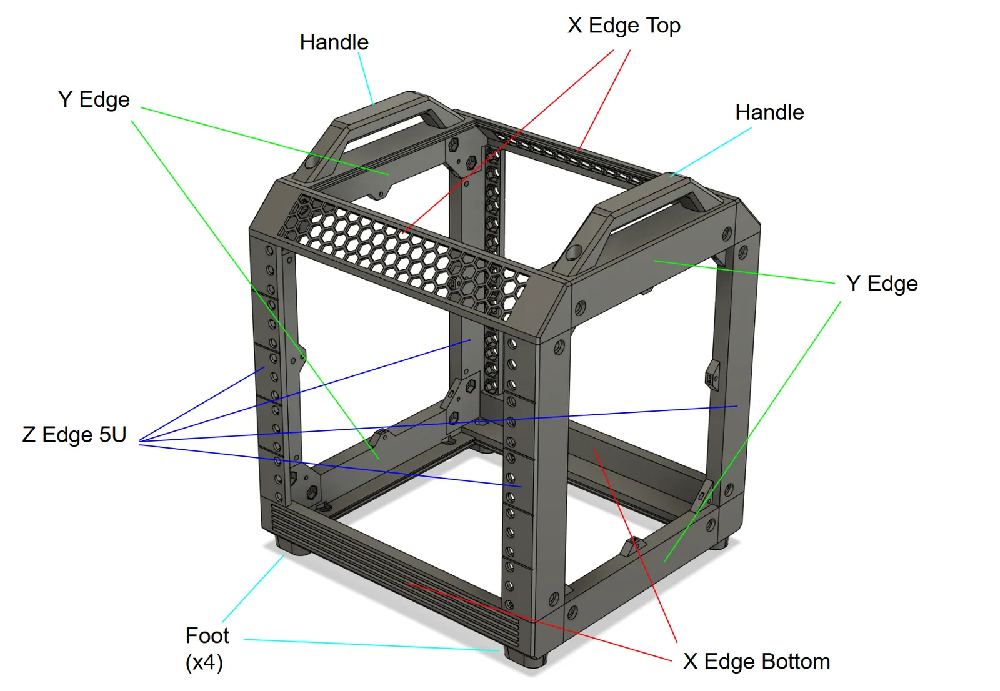</a>

### (2) PANEL profile (optional)

Panels are in a separate profile. Print what you need from the PANEL profile.

| File name | Description |
|---|---|
| TB Panel 12cm-fan | Top/bottom panel (120 mm fan) |
| TB Panel 14cm-fan | Top/bottom panel (140 mm fan) |
| TB Panel mesh | Top/bottom panel (mesh) |
| TB Panel plane | Top/bottom panel (solid) |
| LR Panel mesh 5U | Side panel (mesh) |
| LR Panel plane 5U | Side panel (solid) |

<a href="image/names_panel.webp" target="_blank" rel="noopener noreferrer">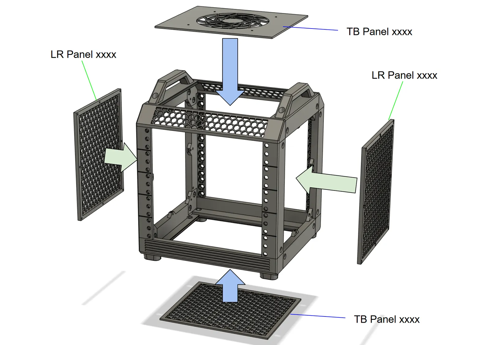</a>

### (3) EXTEND profile (optional)

To add 3U or 5U of height, print what you need from the EXTEND profile. Parts labeled "3U" are for a 3U extension. For a 5U extension, use parts from BASIC and PANEL.

| File name | Description | 3U | 5U |
|---|---|---:|---:|
| Extend Unit | Extension unit | 2 | 2 |
| Extend Unit-cover | Extension unit screw covers | 6 | 6 |
| Z Edge 3U | Vertical mounting rail, 3U | 4 |  |
| Rail Holder-L 3U | Support rail bracket, left, 3U | (2) *1 |  |
| Rail Holder-R 3U | Support rail bracket, right, 3U | (2) *1 |  |
| LR Panel mesh 3U | Side panel (mesh), 3U | (2) |  |
| LR Panel plane 3U | Side panel (solid), 3U | (2) |  |

Note: *1 ... Print only if you use support rails

For details, see [Assembling the extension kit](#assembling-the-extension-kit) in this guide.

### (4) RAIL profile (optional)

Support rails are optional. They can hold heavy shelves, but only certain shelves will fit. See [Using the support rails](#using-the-support-rails-optional) in this guide.

| File name | Description | Qty | Notes |
|---|---|---:|---|
| Rail Holder-L 5U | Support rail bracket, left | (2) | *1 |
| Rail Holder-R 5U | Support rail bracket, right | (2) | *1 |
| Rail-1U | Support rail (1U) | (2 per U) | *1 |
| Rail-1.5U | Support rail (1.5U) | (2 per U) | *1 |

Note: *1 ... Print only if you use support rails

For details, see [Using the support rails](#using-the-support-rails-optional) in this guide.

## STEP 1 Installing the nuts

After printing, take the X Edge Top/Bottom, Y Edge, and Z Edge 5U parts.
Press-fit the M3 nuts used to mount the panels.

<a href="image/m3nut-1.webp" target="_blank" rel="noopener noreferrer">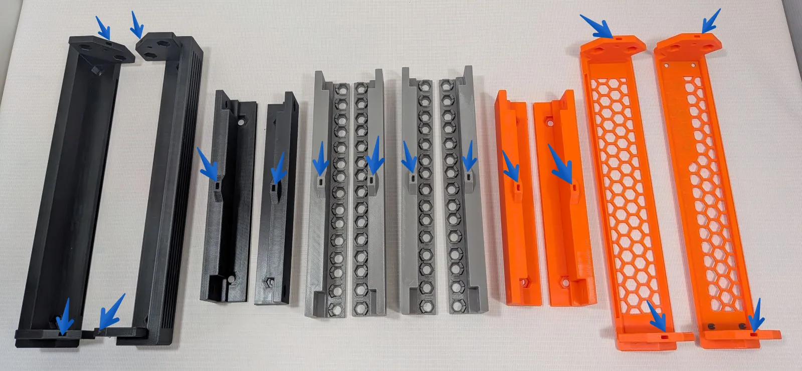</a>

Push them all the way in with a flat-head screwdriver or a thin rod.

<a href="image/m3nut-2.webp" target="_blank" rel="noopener noreferrer">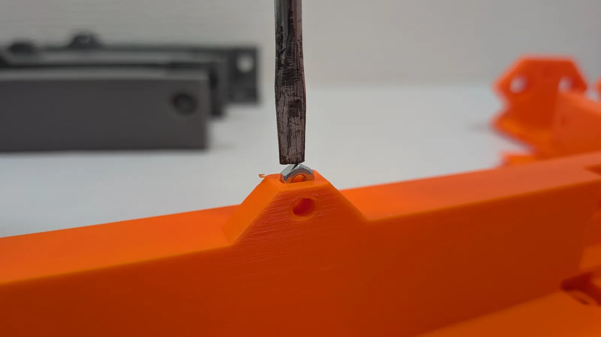</a>

## STEP 2 Assembling the bottom

Assemble the bottom frame. Fit X Edge Bottom and Y Edge together, and slide in the TB Panel you chose. Watch the direction of the panel grooves. Once everything is seated, fasten with M6 nuts and M6 screws. If a nut is too tight, use pliers. If it is loose, a small amount of glue helps.

<a href="image/bottom-1.webp" target="_blank" rel="noopener noreferrer">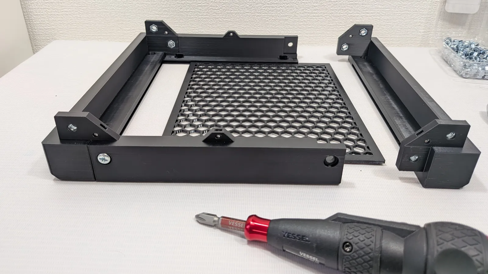</a>

Flip it over and install the Foot parts. Do not use the inner holes.

<a href="image/bottom-2.webp" target="_blank" rel="noopener noreferrer">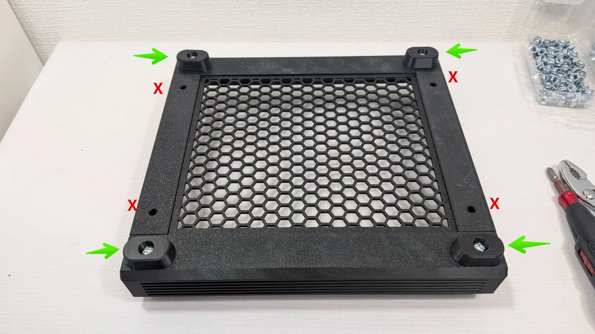</a>

## STEP 3 Assembling the top

Assemble the top frame. Fit X Edge Top and Y Edge together, and slide in the TB Panel you chose.

<a href="image/top-1.webp" target="_blank" rel="noopener noreferrer">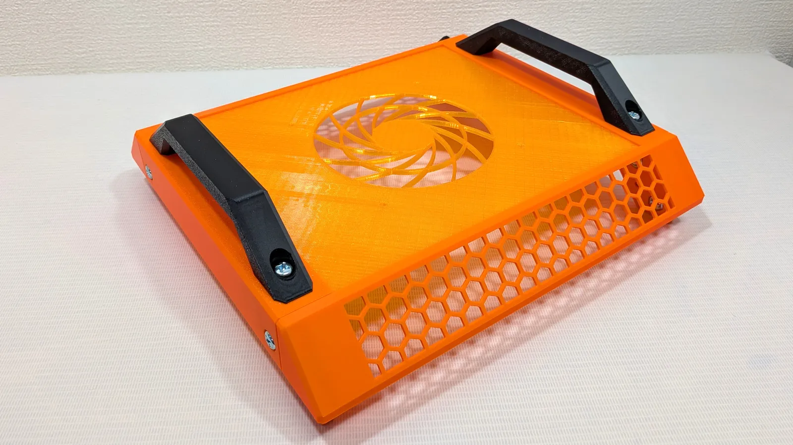</a>

Then install the Handle parts.

## STEP 4 Support rails (optional)

If you are not using support rails, skip to STEP 5. Support rails can hold heavy shelves. If you use them, you need to prep the mounting rails before final assembly.

### Installing heat-set inserts

Install heat-set inserts in Z Edge 5U, Rail Holder-L 5U, and Rail Holder-R 5U. Use the smaller holes.

<a href="image/inut-1.webp" target="_blank" rel="noopener noreferrer">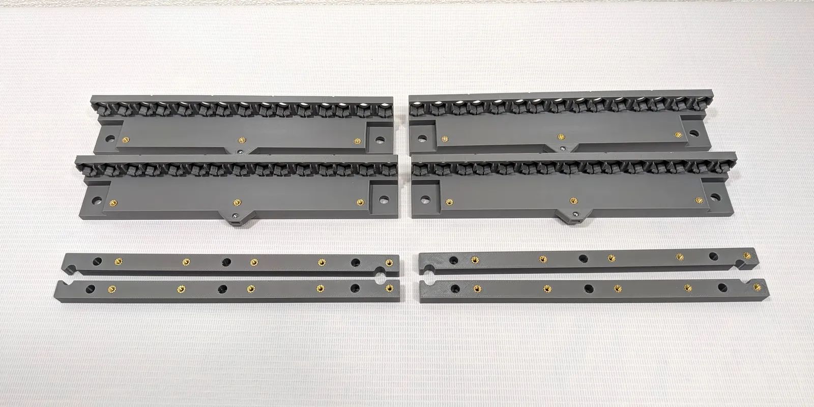</a>

Insert size: ID 3 mm, OD 5 mm, length 4 mm

### Attaching the rail holders

Attach the Rail Holder-* 5U parts to Z Edge 5U. Fasten with M3 × 5 mm screws. Watch the orientation: arrange them as in the photo, with the ▼ marks pointing down.

<a href="image/inut-2.webp" target="_blank" rel="noopener noreferrer">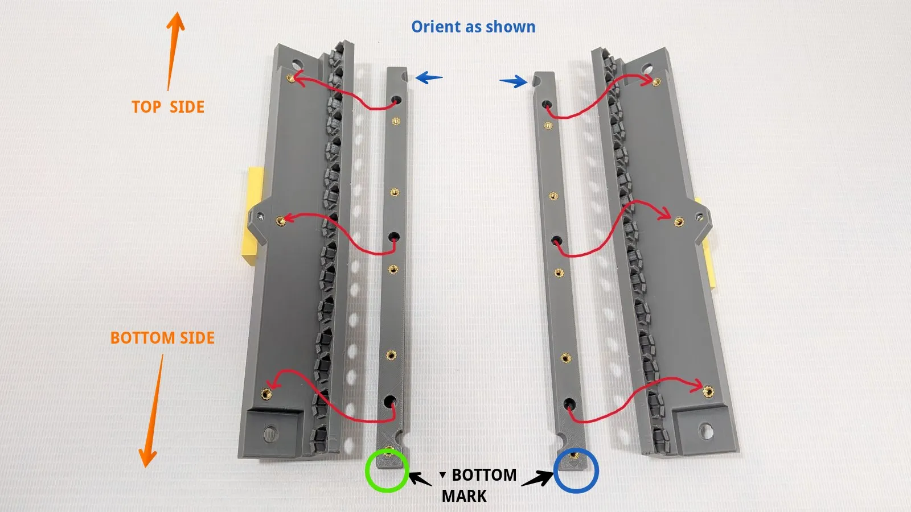</a>

Finished assembly:

<a href="image/inut-3.webp" target="_blank" rel="noopener noreferrer">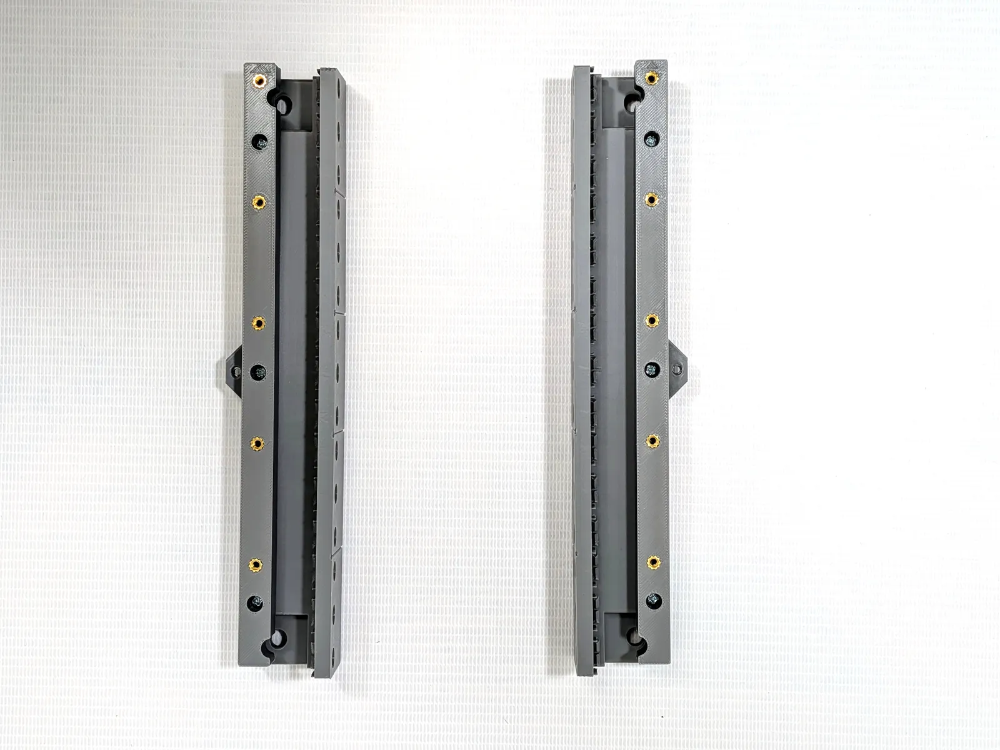</a>

If the M6 screw holes are blocked, the parts are on the wrong side. Compare with the photo and flip them.

## STEP 5 Putting the rack together

Connect the bottom frame to the mounting rails (Z Edge 5U) with M6 × 12 mm screws. Insert the nuts first, set the rail position, then tighten the screws.

<a href="image/asm-1.webp" target="_blank" rel="noopener noreferrer">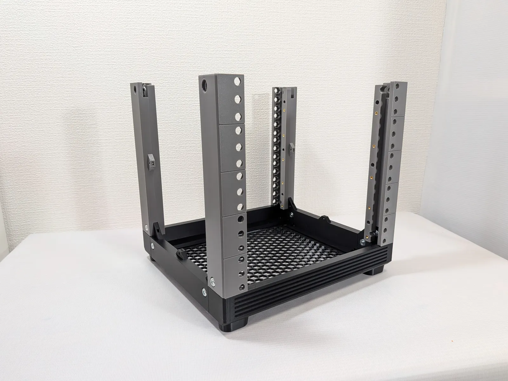</a>

If you use support rails, keep the ▼ marks pointing down. If you do not, either end up is fine.

Install the top frame the same way.

<a href="image/asm-2.webp" target="_blank" rel="noopener noreferrer">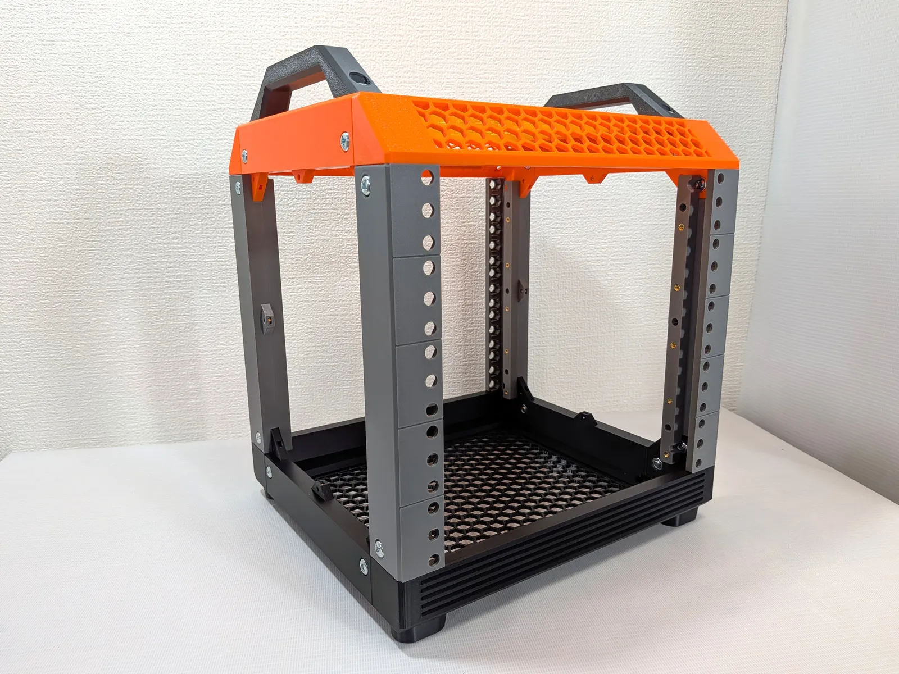</a>

## STEP 6 Side panels (optional)

If you use side panels, fasten them to the frame with M3 × 12 mm screws.

<a href="image/side-1.webp" target="_blank" rel="noopener noreferrer">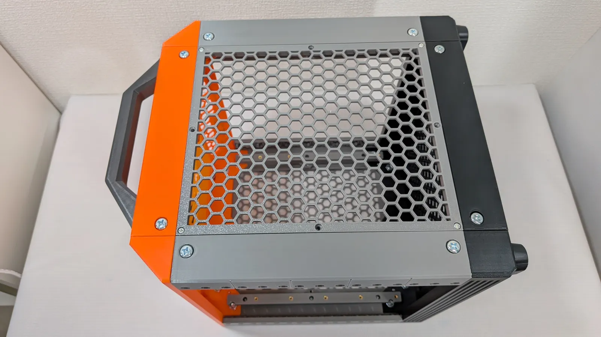</a>

## Done!

Congratulations — your server rack is finished.

<a href="image/side-2.webp" target="_blank" rel="noopener noreferrer">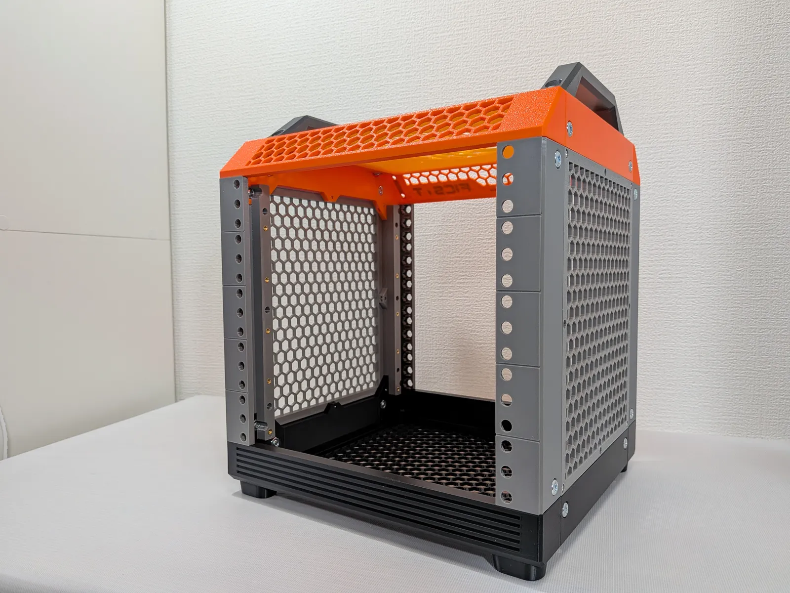</a>

Enjoy your homelab!

## Installing cage nuts

Install M6 nuts in the mounting rails. Slide each nut in from the side and press with your finger until it clicks into the hole.

<a href="image/movie-1.webp" target="_blank" rel="noopener noreferrer">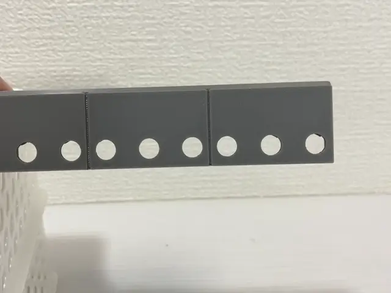</a>

When you mount gear with M6 screws, do not push the screw in hard. Too much force will pop the nut out.

## Assembling the extension kit

This example adds 3U. Print the parts from the EXTEND profile. Press-fit M3 nuts into the Extend Unit, then install the covers. Also install the M6 nuts.

<a href="image/ext-1.webp" target="_blank" rel="noopener noreferrer">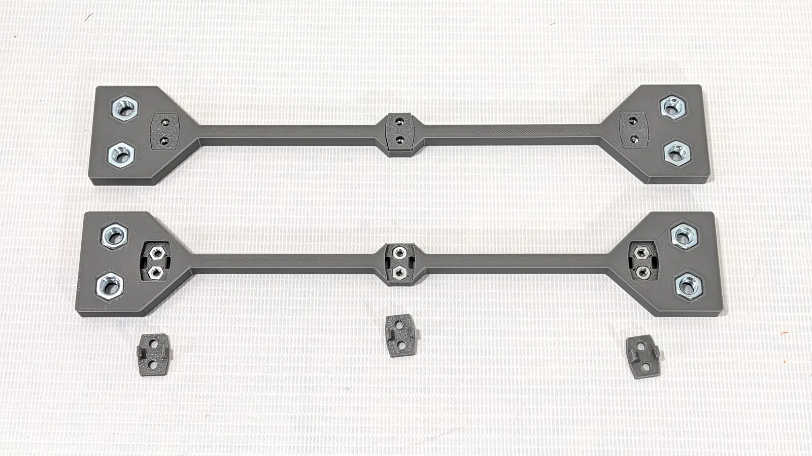</a>

Remove the top, and attach the Extend Unit parts to the mounting rails. Orient them as shown in the photo.

<a href="image/ext-2.webp" target="_blank" rel="noopener noreferrer">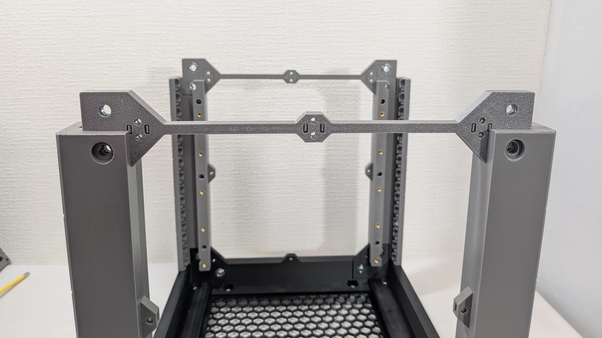</a>

Install the extra mounting rails. If you use the optional support rails, attach those first.

<a href="image/ext-3.webp" target="_blank" rel="noopener noreferrer">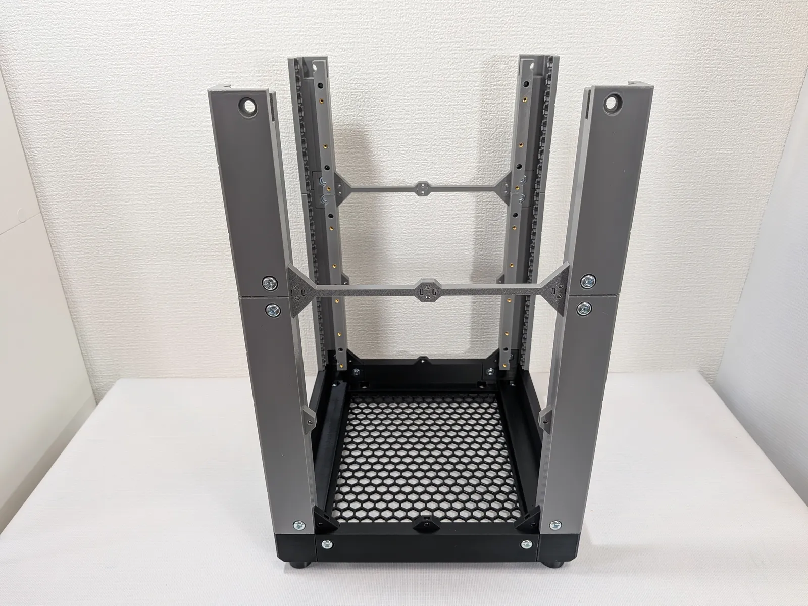</a>

Put the top back on to finish.

<a href="image/ext-4.webp" target="_blank" rel="noopener noreferrer">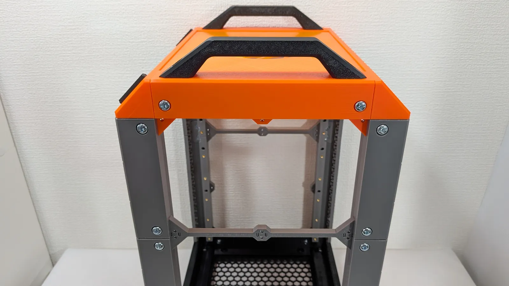</a>

If you use side panels, install them last.

<a href="image/ext-5.webp" target="_blank" rel="noopener noreferrer">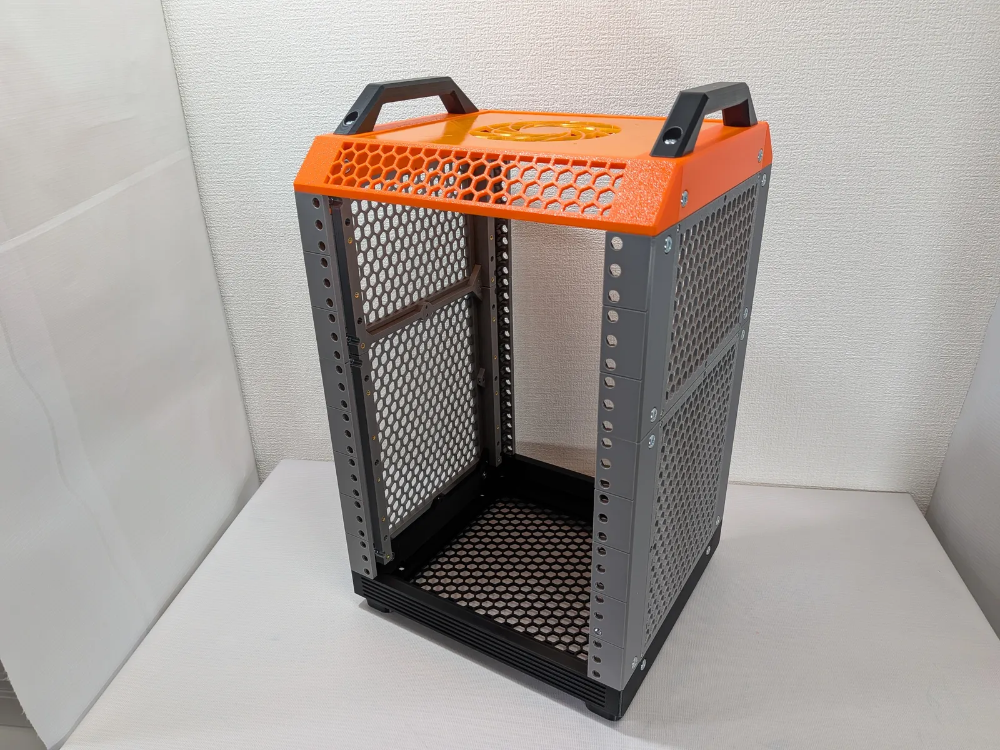</a>

## Using the support rails (optional)

Support rails are optional. They can hold heavy shelves, but only certain shelves will fit.

### Compatible shelves

* Width: 215 mm or more
* Depth: 90 mm or more

### Shelf 3D models

The following models are included:

* [Templates](../shelf/template/)  
  (The front panel area is left blank. Modify it to suit your needs.)
* [5.25-inch drive](../shelf/5-inch_drive_1U/)

### Installing the support rails

Fasten Rail-1U with M3 × 5 mm screws. For a 1.5U shelf, use Rail-1.5U.

<a href="image/rail-1.webp" target="_blank" rel="noopener noreferrer">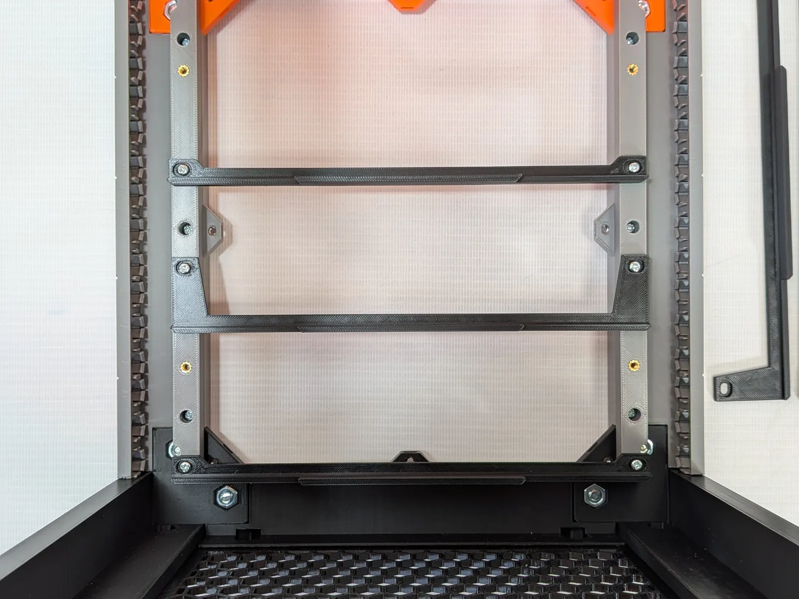</a>

The shelf sits on the support rails, so heavy gear does not load the mounting rails.

<a href="image/rail-2.webp" target="_blank" rel="noopener noreferrer">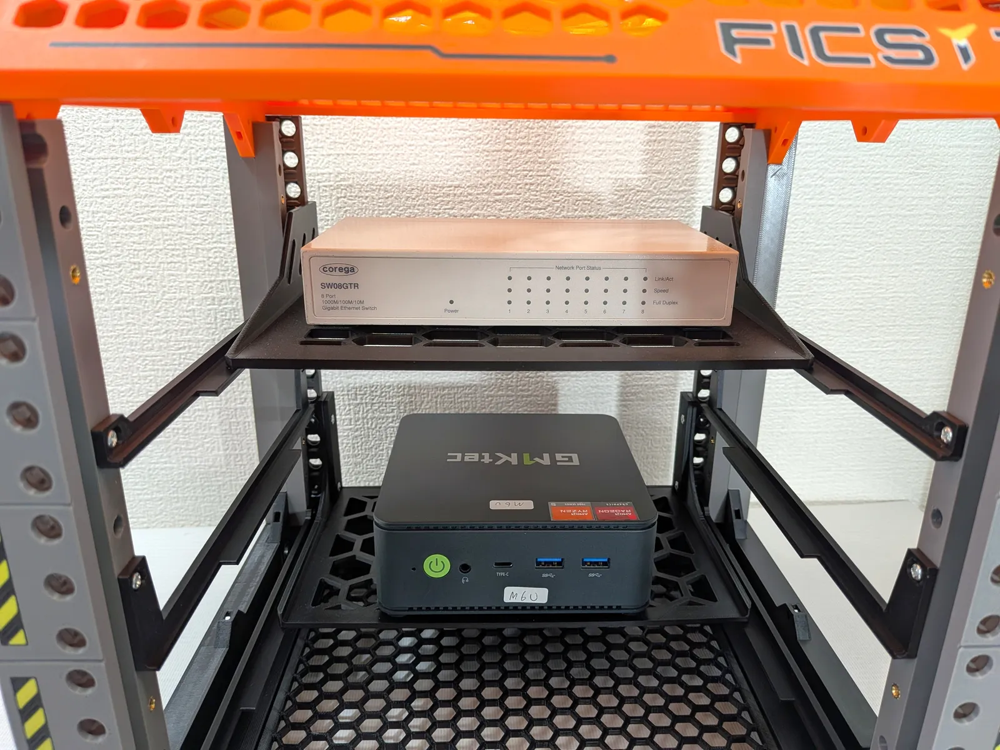</a>
